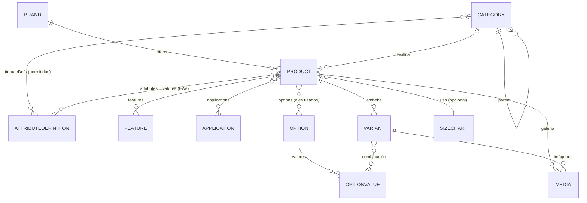

# PIM Dinámico — Diseño de entidades (Etapa 1)

> Objetivo: que un administrador cree **cualquier tipo de prenda** con sus propios
> atributos, características, opciones y variantes **sin que un programador toque el
> modelo ni el código**. El principio es *data-driven*: la definición del atributo
> ES el dato.

**Decisiones cerradas:** Feature y Attribute son entidades separadas · variantes
**embebidas** en Product · SizeChart es una **colección reutilizable** · OptionValues
es un **pool global** compartido.

---

## El mecanismo (cómo se cumple "sin tocar código")

```
1. Admin crea una AttributeDefinition   (ej. "Protección UV", tipo boolean)
2. La asigna a una Category              (ej. "Seguridad", required=false)
3. Al crear un Product de esa categoría, el panel PINTA el formulario leyendo
   los attributeDefs de la categoría (heredando los del padre)
4. La API valida los valores contra la definición (tipo, opciones, min/max, requerido)
5. El catálogo filtra por cualquier atributo marcado como `filterable`
```
Añadir un atributo nuevo = crear un registro + asignarlo a una categoría. Cero código.

---

## Diagrama de entidades



---

## Entidades (definición de campos)

### AttributeDefinition  *(colección nueva)*
Define un atributo tipado y reutilizable.
```
key         String   único, snake_case, estable  → "proteccion_uv", "gramaje"
label       String   "Protección UV"
type        enum     text | number | boolean | select | multiselect
unit        String?  "g/m²"  (para number)
options     [{ value, label }]   solo para select/multiselect
validation  { min?, max?, regex?, maxLength? }
filterable  Boolean  default false  → ¿aparece como filtro en el catálogo?
group       String?  "Especificaciones"  (para agrupar en el formulario)
orden       Number
activo      Boolean  default true
```
Índice: `key` único.

### Feature  *(colección nueva)*
Catálogo de características / insignias (presencia sí-no, con ícono).
```
nombre  String   "Cinta reflejante 3M"
slug    String   único
icono   String?  nombre de ícono o URL
descripcion String?
orden   Number
activo  Boolean
```

### Application  *(colección nueva)*
Catálogo de personalizaciones (reemplaza el texto libre actual).
```
nombre  String   "Bordado"
slug    String   único
descripcion String?
icono   String?
activo  Boolean
```

### Option  *(colección nueva)*
Un eje de variación.
```
nombre  String   "Color", "Talla"
slug    String   único
tipo    enum     swatch | size | text   (pista para la UI)
orden   Number
activo  Boolean
```

### OptionValue  *(colección nueva)*
Valor de un eje (pool global compartido).
```
option  ref Option   (required)
valor   String       "Negro", "M"
slug    String       "negro", "m"  (para filtros)
meta    Mixed?       { hex: "#000000" }  (para swatches de color)
orden   Number
activo  Boolean
```
Índice: `{ option, slug }` único.

### Category  *(enriquecida)*
Agrupa productos **y define qué atributos aplican**.
```
nombre, slug, parent (ref Category), orden, activo     (como hoy)
attributeDefs: [{ attribute: ref AttributeDefinition, required: Boolean, orden: Number }]
```
**Herencia:** al resolver el formulario de un producto, se combinan los `attributeDefs`
de toda la cadena de padres (los propios ganan sobre los heredados).

### SizeChart  *(colección nueva, reutilizable)*
Tabla de medidas asignable a muchos productos.
```
nombre   String   "Playera unisex estándar"
slug     String   único
unidad   enum     cm | in   default cm
columns  [String] ["Pecho", "Largo", "Hombros"]
rows     [{ label: String, values: [Number] }]   // values alineado con columns
activo   Boolean
```

### Product  *(enriquecido)*
```
nombre, sku (único), slug (único), descripcion
brand        ref Brand
category     ref Category
sexo         enum  hombre | mujer | unisex        (se mantiene de primer nivel)
attributes   [{ attribute: ref AttributeDefinition, value: Mixed }]   // EAV (valores)
features     [ref Feature]
applications [ref Application]
options      [{ option: ref Option, values: [ref OptionValue] }]      // ejes + valores disponibles
variants     [Variant]                                                // embebidas
sizeChart    ref SizeChart?                                           // opcional
faq          [{ pregunta, respuesta }]
media        [Media]                                                  // galería del producto
destacado, activo, timestamps
```
> **Nota:** el bloque fijo `tela {material, composicion, tipo, peso, cuidados}` de hoy
> se **elimina** y se expresa como AttributeDefinitions (material, gramaje, tipo de tela,
> cuidados…). Así también la tela queda dentro del motor dinámico. La composición por
> color sigue viviendo en la variante.

### Variant  *(subdocumento embebido en Product)*
Una combinación concreta de valores de opción.
```
_id
sku          String   único (validado a nivel de app)
optionValues [ref OptionValue]   // un valor por cada eje declarado: [Negro, M]
composicion  String   texto libre  ("60% algodón, 40% poliéster")
price        Number   default 0
stock        Number   default 0    (listo para inventario)
media        [Media]  imágenes específicas de esta variante
activo       Boolean
```

### Media  *(subdocumento embebido)*
```
url, public_id, alt, orden, principal, tipo (image)
optionValue  ref OptionValue?   // permite "imágenes por color"
```

---

## Validación dinámica (el corazón del motor)

Al crear/actualizar un Product, la **capa de servicio** hace:
1. Resuelve los `attributeDefs` de la categoría + heredados de padres.
2. Verifica **requeridos** presentes.
3. Valida cada valor según su `type`:
   - `number` → numérico, respeta `min`/`max`
   - `boolean` → true/false
   - `select` → el valor ∈ `options`
   - `multiselect` → subconjunto de `options`
   - `text` → respeta `regex`/`maxLength`
4. **Rechaza** atributos no permitidos por la categoría (error claro con el campo).
5. Valida que `variants[].optionValues` tengan exactamente un valor por eje declarado,
   todos dentro de `options[].values`, y que la combinación no se repita.

Zod valida la **forma** externa (que `attributes` sea un array bien formado); la
validación **semántica por-atributo es data-driven** → añadir un atributo no toca el código.

---

## Filtrado en el catálogo (facetas)

- Por atributo: `attributes: { $elemMatch: { attribute: <id>, value: <v> } }`
  con índice `{ 'attributes.attribute': 1, 'attributes.value': 1 }`.
- Por feature / application / valor de opción: filtro por `ref` (id) o `slug`.
- Facetas dinámicas: agregación de valores distintos por categoría para construir la UI de filtros.

---

## Índices previstos
- `AttributeDefinition.key` único · `Feature.slug` · `Application.slug` · `Option.slug` únicos
- `OptionValue { option, slug }` único
- `Product`: `sku` único, `slug` único, `brand`, `category`, `activo`,
  compuesto `{ brand, category, activo }`, `{ 'attributes.attribute', 'attributes.value' }`,
  `features`, `applications`, texto en `nombre/descripcion/sku`

---

## Impacto y migración (se ejecuta en Etapa 3)
Es un cambio **profundo** de Product. Se hará en una rama, con migración:
- `aplicaciones` (texto) → colección **Application** + `product.applications` (refs)
- `atributos` (Map) + `tela` (bloque fijo) → **AttributeDefinition** + `product.attributes` (EAV)
- `variants {color, composicion, tallas}` → **Option**/**OptionValue** (Color, Talla) +
  `product.options` + `variants` generadas por combinatoria
- Se preservan Brand/Category (Category gana `attributeDefs`) y el producto existente.
- Requiere un **seed** inicial: Options Color/Talla con valores comunes, Applications
  (bordado/dtf/vinil/sublimado), y un set base de AttributeDefinitions asignadas a categorías.
- El frontend (formulario dinámico + generador de variantes) se rehace en la Etapa 4.

---

## Prueba de cobertura (Etapa 5)
Crear **sin tocar código**: Playera, Camisa, Pantalón, Chamarra, Uniforme industrial y
Producto de seguridad — cada uno con sus atributos propios (p. ej. Pantalón: cintura/tiro;
Seguridad: protección UV/cinta reflejante) definidos solo con datos.
